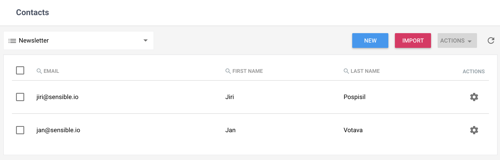
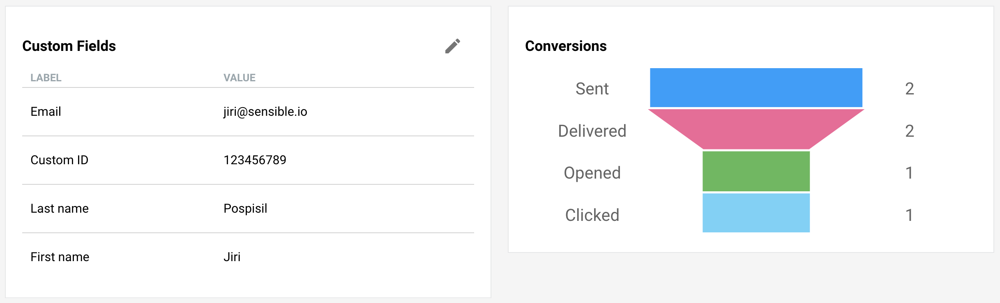
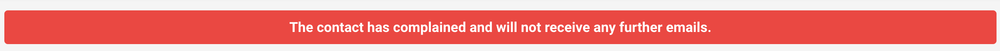

One of the primary features of SendingBee is to collect and store email
addresses of your audience. Over time, you might want to store more than just
an email address - maybe their first name, age, address or maybe an
identifier linking back to your systems. We call the collection of
information about a particular email address a **Contact**. You can see all
of your contacts by clicking on "Contacts" in the left sidebar.

#### Lists and segments

On the top, there's selection with lists and segments. You can use this to
show only contacts belonging to the selected entry. Here we're showing
contacts in the "Newsletter" list.

  

#### Custom fields

Once you click a contact, you will see a screen with various details gathered
over time. The individual attributes (e.g. email or first name) are called
[Custom fields](/contacts/custom-fields). There are a few Custom fields
created by default but you can also create your own. Every Custom field have
its name and enforced type.

  

You can [search](/api/contacts#seach-by-query.md) or even
[update](/api/contact#update-by-query) based on contacts' custom fields using
our [API](/api.md).

#### Events

Besides the information you assign to contacts manually or via [Signup
forms](/signup-forms.md), contacts also store information and performance of
campaigns sent to them and the progress a contact has made with them.
Clicking on each event will also reveal additional information.

  

#### Unsubscribed, Bounced, and complained

No matter how much you try to keep the list of contacts up to date, not very
email will arrive to its destination or is wanted. SendingBee tracks whether
an email has hard bounced, or the contact's pressed the Spam or Unsubscribe
button.

If the contact has unsubscribed, they will be removed from lists to which the
email was sent but may receive emails in the future from other lists.

In case the contact has bounced or complained, SendingBee will not send any
more emails to that contact. You can see whether a contact bounced or
complained on the list of all contacts or in the contact's detail screen.

  

Continue to [Lists](/lists.md).
