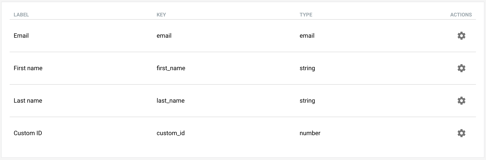

Every contact has a set of attributes associated with it. We call them custom
fields. By default, every contact has a custom field for their email address,
first name, and last name. You can of course add more custom fields. For
example, you might want to store a Custom ID from your existing system to
easier mapping.

  

Each custom field has the following properties:

- **Label**: A human friendly description of the field. This is used when the
field is part of a [Signup form](/signup-forms).
- **Key**: A machine friendly identifier of the field. This is used when
interacting with SendingBee using its [API](/api).
- **Type**: A data type of the field. The following types are supported:
  - **string**: A UTF-8 encoded string. Maximum of 100 characters allowed.
  - **email**: The same as **string** but the format is validated to be a valid email address.
  - **number**: An integer number in range from -9007199254740991 to
  9007199254740991 (both inclusive).
  - **date**: A YYYY-MM-DD formatted date.
  - **boolean**: A true or false value.

As we will discuss in the API's [Contacts](/api/contacts) section, you can
also use custom fields to update a specific contact. For example, you might
want to change custom fields for a contact with **Custom ID** equal to 123.
This makes it easy to sync data between SendingBee and your existing systems.

Continue to [Import from CSV](/contacts/import-from-csv.md).
