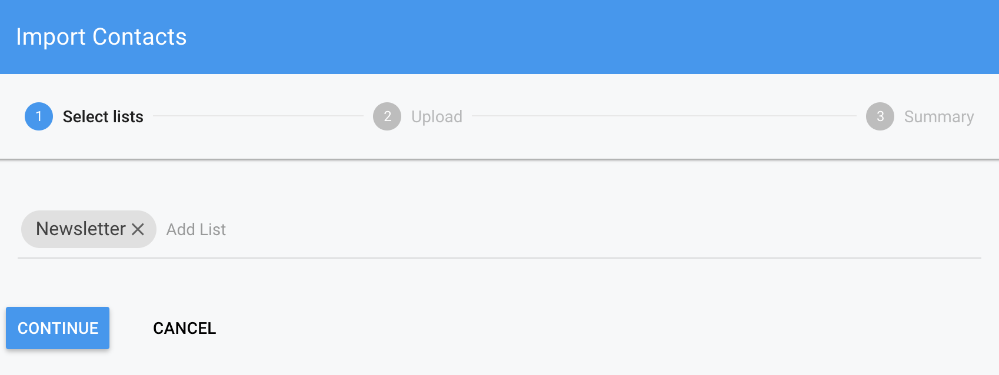
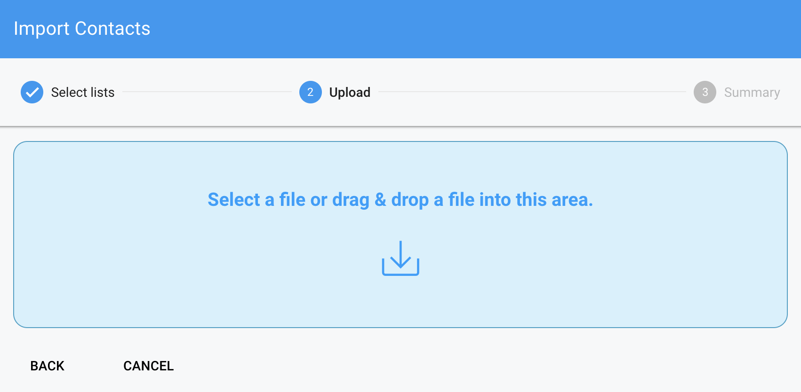
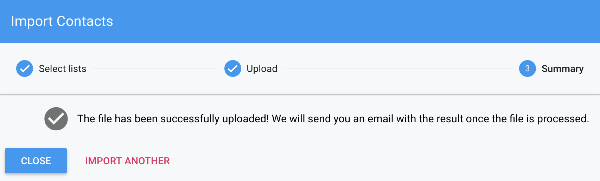

SendingBee allows to import existing contacts from CSV files of up to 20MB.
The files should contain a header where each value corresponds to a key of an
*existing* [Custom field](/contacts/custom-fields.md).

```
email,first_name,last_name,custom_id
jiri@sensible.io,Jiri,Pospisil,123456789
jan@sensible.io,Jan,Votava,987654321
```

First, create a [List](/lists.md) to which you want the imported contacts
assigned. Next, continue to Contacts in the left menu and click "Import".
Select the list you've created in the previous step and click Continue.

<p class="centered">
  
</p>

Next, drag & drop a CSV file with the contacts to import. Make sure the file
has the correct format as specified above. Note that if your browser doesn't
support drag & drop (or if you prefer), you can select the file via the
standard dialog by clicking on the icon in the middle.

<p class="centered">
  
</p>

Depending on the number of contacts, the import process can take a while. You
will receive an email when the process is finished with the number of
imported contacts or encountered errors.

<p class="centered">
  
</p>

Continue to [Lists](/lists.md).
