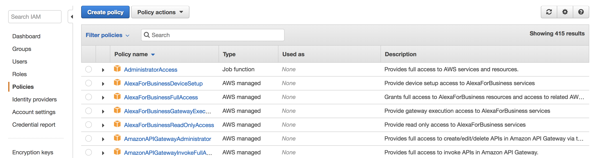
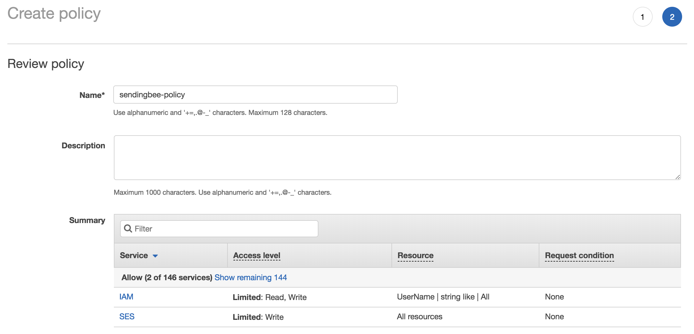
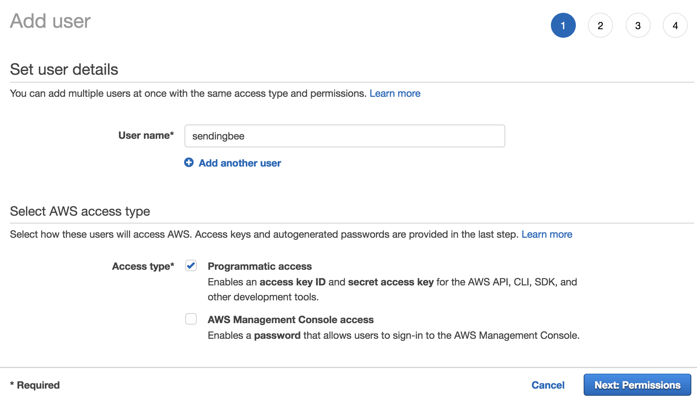
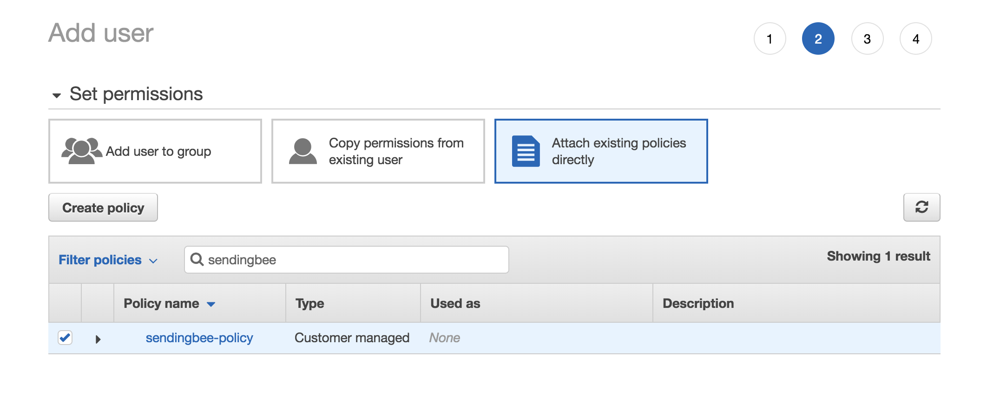
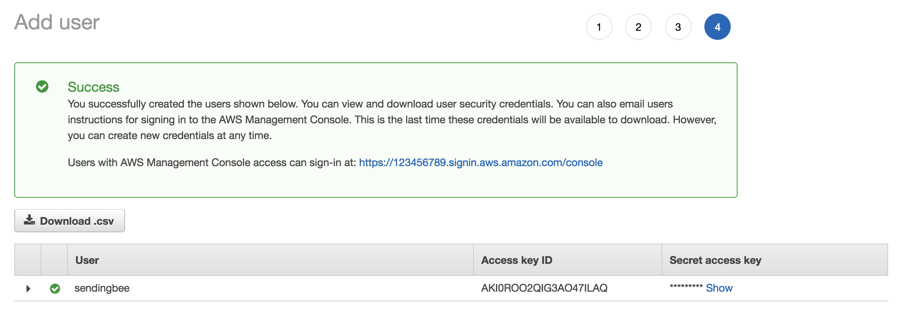

To enable SendingBee send emails from your AWS SES account, it needs access
to it. Of course we don't need (nor want!) access to anything besides the
functionality which allows us to send emails. Fortunately, AWS supports
creating different sub-users with limited permissions. This way you can be
absolutely certain we cannot do anything else with your account even if we
wanted to.

#### Create policy

First, you need to create a so called policy. A policy is a set permissions
which say which actions can or cannot be performed. Head over to [Identity and Access Management's
Policies](https://console.aws.amazon.com/iam/home?#/policies) (IAM) and click
*Create policy*.

<p class="centered">
  
</p>

Select the *JSON* tab. Don't mind the warning at the top, it's just warning
you that the prefilled empty policy is not valid. Replace the prefilled
policy with the following:

```json
{
    "Version": "2012-10-17",
    "Statement": [
        {
            "Effect": "Allow",
            "Action": [
                "ses:*"
            ],
            "Resource": "*"
        },
        {
            "Effect": "Allow",
            "Action": [
                "iam:GetUser",
                "iam:DeleteAccessKey"
            ],
            "Resource": "arn:aws:iam::*:user/*"
        }
    ]
}
```

The policy says that we are able to fully control SES - we need this to
configure your SES account and to actually send the emails. The policy also
allows us to get your account's ID and, finally, it allows us to delete the
access key you will give us in the next step. This is to ensure that in case of
a breach we're able to invalidate the key such that nobody can use it. It's just
a precaution.

Click *Review policy* to continue. The *name* of the policy can be arbitrary
but be sure to remember it for the next step. Click *Create policy* to save
the policy.

<p class="centered">
  
</p>

#### Create limited keys

Now that the policy is created, you need to create a user which will then be
assigned this newly created policy. Head over to [Identity and Access
Management's Add
user](https://console.aws.amazon.com/iam/home?#/users$new?step=details).

The **name** of the new user doesn't really matter but choose something that
will make it clear to you this is the user SendingBee uses. If you later
delete this user, SendingBee will immediately lose access to your account.

As for **Access type**, choose *Programmatic access*. SendingBee doesn't need
to actually log in but rather uses AWS API to perform the actions. Continue
by clicking *Next: Permissions*.

<p class="centered">
  
</p>

Next, you need to attach the policy you've created in the previous step to
the user. Select the *Attach existing policies directly* box at the top and
then search for the policy by name. Finally, check the box next to the name,
click *Next: Review* and *Create user* on the next page.

<p class="centered">
  
</p>

Now that the user is created, AWS gives you its **Access key ID** and
**Secret access key**. The Secret access key will be revealed by clicking on
*Show*. Note that AWS will not show you the Secret access key again later.
This screen is the only time you are be able to copy its value. Keep note of
both of them. If you lose it, don't worry - you can create a new pair later.

<p class="centered">
  
</p>

These two values are the credentials you will need when creating a Delivery
provider within SendingBee. Continue to create [delivery
provider](/delivery-providers/delivery-provider.md).
