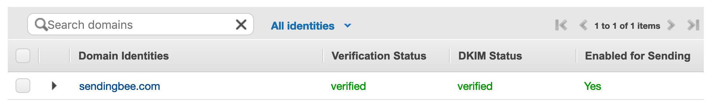

?> If you have any questions or encounter any problems during the setup
process, please do not hesitate to contact us at
[support@sendingbee.com](mailto:support@sendingbee.com). We are here to help.

SendingBee integrates with [Amazon Simple Email Service (AWS
SES)](https://aws.amazon.com/ses/). AWS SES is a well known service used by
tens of thousands of businesses around the world.

To use AWS SES, you need to have an AWS account. If you don't already have an
account, you need to [create one](https://portal.aws.amazon.com/billing/signup).
If you're already familiar with AWS SES and have it set-up to send emails, you
can skip to the end of the page. Just make sure that your [Email Feedback
Forwarding](#email-feedback-forwarding) is disabled.

#### Region

Once you're logged into your account, head over to [Amazon Simple Email
Service](https://console.aws.amazon.com/ses). Notice that in the top right
corner it specifies a region.

  

Every AWS SES configuration belongs to a specific region. Your sending quota,
limits, verified domains, and other configuration will be always tied to that
selected region. The region will also determine where the actual emails will be
sent from.

If you've already used AWS SES before and have it setup in a particular
region, you can use that configuration. If you're just getting started, it's
best to select *EU (Ireland)*. SendingBee is based in Europe and this is the
closest region to us - we will be able to send your emails faster.

#### Domain verification and DKIM

Next, you need to verify a domain name. This is the domain name that will be
used as part of the email address your customers will see in the "From" field
of an email. For example, if you want to send from *info@example.com*, you
need to proof that you own the domain name *example.com*.

Navigate to [AWS SES](https://console.aws.amazon.com/ses) and make sure
you've selected the right region in the top right corner. Select *Domains*
from the menu on the left and click *Verify a New Domain*. We will use
*sendingbee.com* for the domain name in the images but you should of course
replace it with your own domain name.

  

Enter your domain name, check *Generate DKIM Settings* and click *Verify This
Domain*.

  

As the dialog suggests, enabling DKIM signing for your domain is optional.
However, we strongly recommend it (along side with the rest of the steps) as
it can directly affect email deliverability.

?> The way you add TXT and CNAME records to your domain depends on the
registrar you've used to purchase your domain. Look for changing "DNS
records" in their documentation or contact their support. If you are unsure,
please contact us at [support@sendingbee.com](mailto:support@sendingbee.com).

At this point the verification is pending. AWS SES will send you an email
once the verification process has been completed. Note that it can take up to
72 hours but it's usually done within a few minutes.

#### MAIL FROM domain

The next step is to set the MAIL FROM domain. Click *Domains* in the sidebar
and click the domain you've just added. At the bottom choose *MAIL FROM
Domain* and click set.

  

Choose "from" for simplicity. As in the previous step, follow the
instructions to add the new records:

  

#### DMARC

Finally, add the following as yet another TXT record called
*_dmarc.yourdomain.com* (replace "yourdomain.com" with the domain you've
specified as MAIL FROM, in our example case `from.sendingbee.com`). If you know
what you're doing, feel free to adjust the settings as you see fit.

- **name**: _dmarc.yourdomain.com
- **value**: v=DMARC1; p=none; pct=100; rua=mailto:dmarc+a@sendingbee.com; sp=none; aspf=r;

At this point, you should wait until the domain becomes fully verified on AWS
SES's side. If it's not verified within a few hours, please check that you've
set up the DNS records correctly. If the domain is still not verified after 72
hours, please contact us at [support@sendingbee.com](mailto:support@sendingbee.com).

  

#### Email Feedback Forwarding

By default, you get notifications about any bounced or rejected email to your
inbox. SendingBee however handles this for you and there's no need for you to
get notified about these events if you don't want to. To disable it, click on
your domain, click "Notifications" and then "Edit Configuration". In the dialog,
select "Disabled" at the very bottom and click "Save Config".

  

#### Sandbox

All AWS SES accounts first begin in a so called Sandbox. The Sandbox is intended
for developers to test the integration with AWS and only allows to send emails
to a limited number of addresses. To be able to send emails to all email
addresses (to all of your contacts), you need to be moved out of the Sandbox
by requesting a sending limit increase.

  

Clicking the button will lead you to a form where you need to answer a few
questions. Because you're using SendingBee, you can answer Yes to the first few
questions.

  

When asked about your use case, just describe to whom you're going to send
emails and how you've obtained their email addresses. For example, you can say
that you're planning to send emails to your customers/visitors who have opted
into receiving your newsletter. You can mention your website's or project's web
address. You'll hear back from AWS within a few days at most.

All done for AWS SES. Please continue to [the next step](/delivery-providers/aws-iam).
