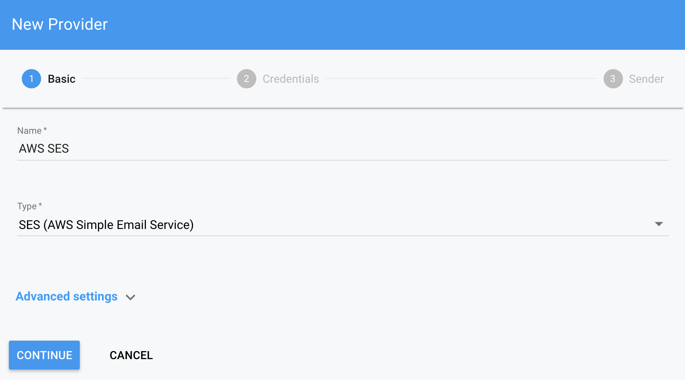
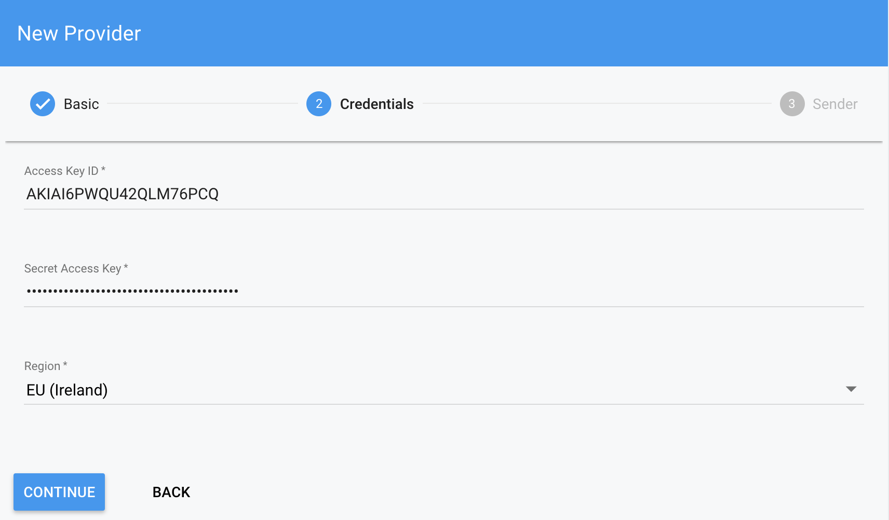
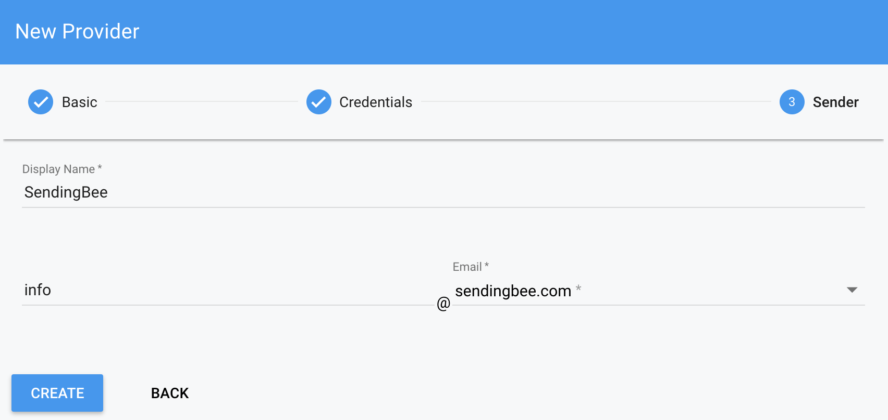

So far we have been setting things up on AWS so it's time actually use it and
create a delivery provider at SendingBee.

Select *Delivery providers* in the left sidebar and click *New*. The **name**
of the delivery provider is only for you to see.

  

Fill in the credentials from the previous step for user *sendingbee*. Don't
forget to select the region you've created the AWS SES configuration in.

  

Next, choose a **Display name**. This is the name that will be visible to
your audience in received emails. Finally, choose an **Email** address that
will appear as the "From" address. You should see the domain you've verified.

  

Finished! From now on the delivery provider is ready. Continue to learn about [Campaigns](/campaigns).
