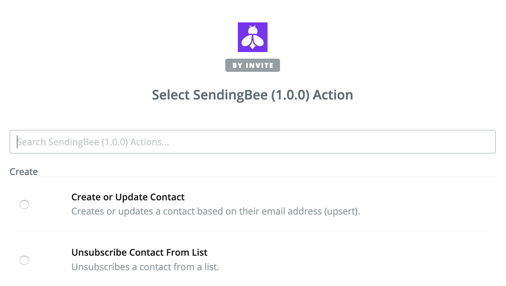

SendingBee can be used with [Zapier](https://zapier.com) to allow easy
integrations with more than 1500 applications including WordPress, Google
Sheets, GMail, and many more. If you haven't used Zapier before, have a look at
their [getting started guide](https://zapier.com/help/basics/).

To get started, you first need to create an API token. Navigate to Settings >
API Tokens, select the project to which you want Zapier to add contacts and
finally check the "Manage Contacts" permission.

  

Click Create and make sure to copy the token value. Next, click the following
link to add SendingBee to your Zapier account:

https://zapier.com/developer/public-invite/20180/aaa8897066c700678bac8dfabee44712

From this point forward, SendingBee will be available as yet another Zapier
Action that you can use in your Zap steps. You will be prompted for the token
value at the "Connect account" step.

  

If you have any questions, please contact us at
[support@sendingbee.com](mailto:support@sendingbee.com).
