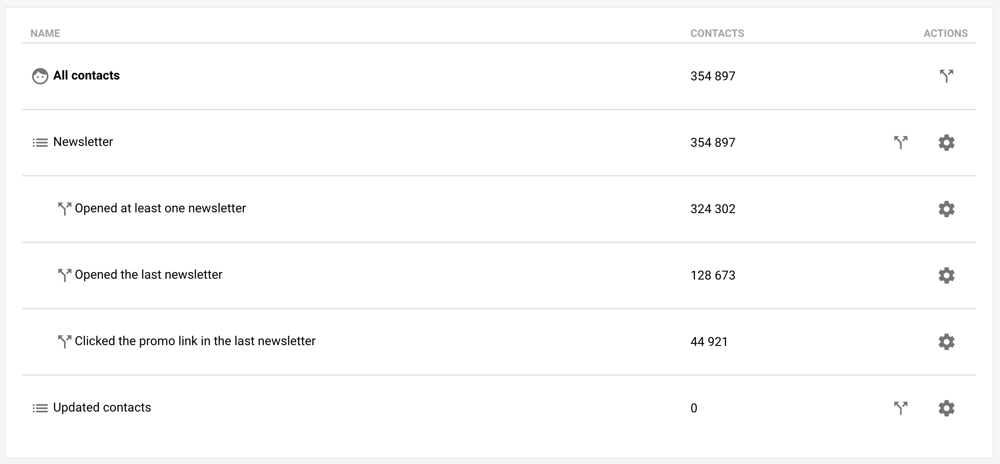

Lists allow you to categorize contacts. Every contact is automatically a
member of a list called "All contacts". Contacts can be assigned to more
lists as needed at any time.

Every list has a few attributes associated with it besides its **name**:

- **Public**: Indicates whether the list is public. This is used to tell whether the list is visible at a contact's preference page. It will also make it possible to use the list in a [Signup form](/signup-forms.md). All lists are private by default which means only you will see how a contact is categorized.
- **Short Description**: When the list is public, this text will appear on a contact's preference page. It will also be used when describing the list in [Signup forms](/signup-forms.md).
- **Description**: An optional longer description of the list. It will only appear on mouse hover.
- **Implicit**: Indicates whether the list should be automatically assigned to newly added or updated contacts. Note that a list cannot be public and implicit at the same time.

Lists are also important when sending [campaigns](/campaigns.md). Lists are
the primary way how to select recipients of a campaign. They also play a role
when a recipient clicks *Unsubscribe* in the body of the email - they will be
automatically removed from the list ([more](/campaigns.md)).

  

Continue to [Segments](/lists/segments.md).
