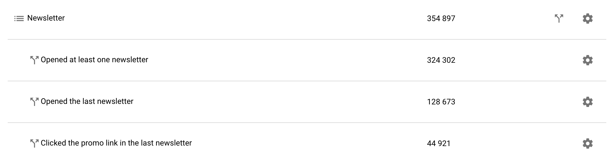
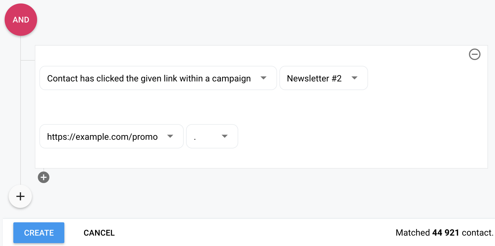
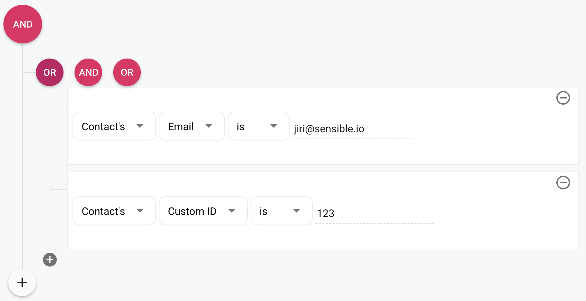

Lists allow you to categorize contacts but often you need to further split a
list based on some criteria. For example, you might want to select only
contacts which have opened a specific campaign or have clicked on a specific
link. Or you might want to filter based on custom fields.

  

Every list can have segments. You can create a segment by clicking on the
arrows on the right. There, you can select exactly what a contact must have
in order to be included in the segment. For example, the last segment from
the picture above would look as follows:

  

Notice that in the bottom right corner you can see in real-time how many
contacts match the currently modeled condition.

By clicking on the plus signs you can add more conditions (and combine them
together) and by clicking on the logical operators you can switch between
"and" and "or".

  

There are quite a few conditions to choose from. Please do not hesitate to
contact us if you're missing any at
[support@sendingbee.com](mailto:support@sendingbee.com).

Continue to [Campaigns](/campaigns.md).
