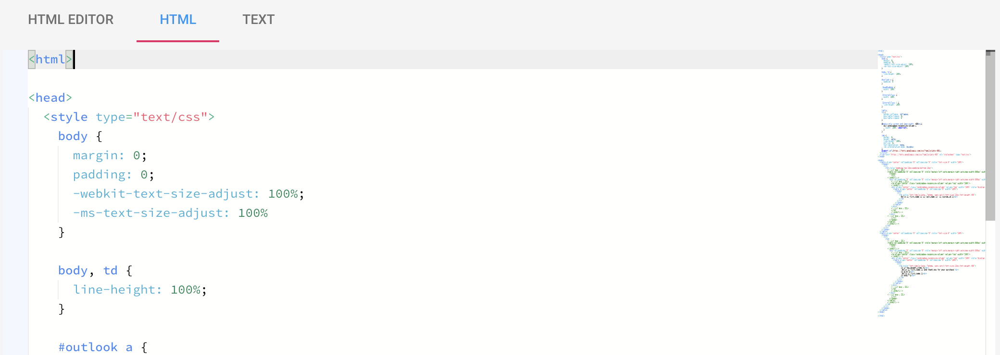

In case you've already got existing templates and don't want to spend time
re-recreating them in the editor, you can import them into the editor by
simply switching to the HTML view, removing the HTML code already there and
pasting your template's HTML instead.

  

The editor will try to parse the template into components as much as it can
but ultimately some portions of the template might simply become plain HTML
components. You can manually replace these with other components if
necessary.

Please continue to [Remote templates](/remote-templates).
